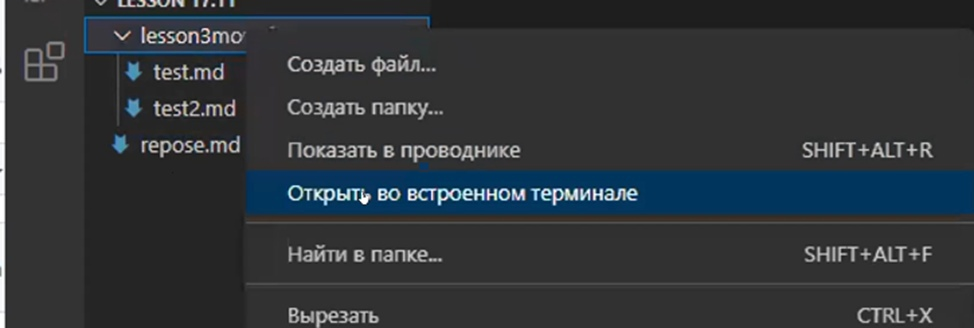

# Домашняя работа
## Начало работы:
1. Скачать Git
2. Скачать VS Code
3. Настроить Git
4. Создать папку (например на РС)
5. Запустить VS Code
6. VS Code в левом верхнем углу открыть проводник
7. Открываем созданную папку
8. Там же, через проводник, в этой папке создаём новый файл
9. Нужно дать Git команду, чтобы она начала отслеживать все изменения в этой папке. Для этого воспользуемся терминалом (можно и более простыми путями). Проверим, что Git настроен. Вид – терминал. Набираем git –version  (для проверки, настроен ли Git. Если настроен – после этой команды терминал выдаст текущую версию).
10. Создать новый файл: в папке git – education вводим название файла с расширением. Он появится в окошке.

## Основные команды:
* git –version   Проверка версии Git, а так же проверку, настроен и синхронизирован ли Git.
* git init   Инициализация. В этой папке гит начнёт отслеживать все изменения. (появится скрытая папка git). Позволяет из папки сделать репозиторий. Это папка, которой настроена система контроля версий.
* git status   Покажет статус. Если всплывает сообщение, что есть изменения, которые не сохранены (modifided: “___”). Можно сохранить его новое состояние. Для этого снова вызовем команду git commit и указываем новый комментарий (например «добавили новую строку»).
* git add + название файла.расширение   добавить файлы, которые нужно включить в сохранение. Добавляет файлу версионность в локальном репозитории.
* git add .   все новые файлы сделать отслеживаемыми. Именно в данной папке. Потом закоммитить.
* git rm имя   удалить файл из отслеживаемых. НО! При этом файл удалится и из самой папки.
* git commit –m “текст коммента”   сделать сохранение или зафиксировать статус.
* git log   (журнал изменений) позволяет позволяет посмотреть, какие вообще версии сохранённого файла существуют. Выводит список нескольких коммитов (сохранений) в хронологическом порядке. Возле каждого сохранения будет комментарий. И имя этого комита, к которому мы можем перейти командой git checkout
* git reflog   более подробный список логов, но не пишет, кто сделал изменения.
* git checkout “_текстовый комментарий сохранения, именно набор символов_”   позволяет перейти к какой-то версии какого-то сохранения. 
* git checkout master   Если мы хотим дальше продолжить работу после переключений между разными версиями – нужно вернуться на самое актуальное состояние. Чтобы всё работало, нужно вернуться в самое актуальное состояние. Master – название той ветви, в которой мы работаем
* git diff   разница между текущим состоянием файла и сохранённым. Если команда ничего не показывает – файлы идентичны.
* git commit –am “thirdcomm”   «объединение» add и commit. Но только для уже отслеживаемых файлов. В примере – 3-ий комментраий.
* git log –p показать более подробные логи изменений.
* git branch   выводит список веток
* git checkout +название ветки   переход на другую ветку.
* git branch +название ветки   Создать новую ветку.
* git merch + название ветки   слить черновик с чистовиком, перелить в ветку master. Если возник конфликт – решить можно только вручную. В тексте можно выбрать одну из веток. Вызывается оттуда, в той ветке, куда нужно залить изменения.
* git branch –d + название ветки   удалить ветку.
* git log –graph   Можно увидеть, на каком этапе была создана ветка, и что было изменено.
* git checkout –b +название ветки   создать ветку и сразу в неё перейти. –b – от слова born
* git merge –abort откатить изменения назад. Вернуться к состоянию до попытки merge.
* git clone   позволяет скопировать и склонировать репозиторий с интернета
* git pull   позвоялет скачать всё актуальное из удалённого репозитория. При этом она ещё и сливает изменения с нашими (merge). Т.е. как бы 2 в 1: fetch + merge
* git push   позволяет отправить то, что есть в нашем репозитории в удалённый
* cd + название файла    chance directory. Изменить директорию, без этого команды не сработают

## Как сделать pull request
1. Делаем fork интересующего репозитория.
2. Делаем  git clone для нашей версии этого репозитория
3. Переходим в "стянуютую папку, открываем для неё встроенный терминал

4. Создаём новую ветку. Производим все изменения только в новой ветке
5. Отправляем все эти изменения на свой аккаунт (push)
6. В окне  на гитхаб появляется возможность отправить pull reqest с изменениями

Благодарю за внимание
